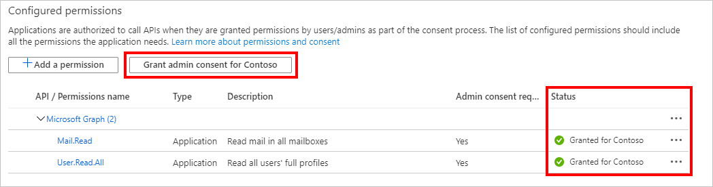

<!-- markdownlint-disable MD002 MD041 -->

在本练习中，将使用 Azure Active Directory 管理中心创建三个新的 Azure AD 应用程序：

- 单页面应用程序的应用程序注册，以便能够登录用户并获取允许应用程序调用 Azure 函数的令牌。
- Azure 函数的应用程序注册，它允许它将由 SPA 发送的令牌用于交换由 SPA 发送的令牌 [，以允许](https://docs.microsoft.com/azure/active-directory/develop/v2-oauth2-on-behalf-of-flow) 它调用 Microsoft Graph。
- Azure 函数 webhook 的应用程序注册，使其可以使用 [客户端凭据流](https://docs.microsoft.com/azure/active-directory/develop/v2-oauth2-client-creds-grant-flow) 在没有用户的情况下调用 Microsoft Graph。

> [!NOTE]
> 此示例需要三个应用注册，因为它同时实现了代表流和客户端凭据流。 如果您的 Azure 函数只使用这些流之一，则只需创建对应于该流的应用程序注册。

1. 打开浏览器并导航到 [Azure Active Directory 管理中心](https://aad.portal.azure.com) ，并使用 Microsoft 365 租户组织管理员登录。

1. 选择左侧导航栏中的“ **Azure Active Directory** ”，再选择“ **管理** ”下的“ **应用注册** ”。

    

## 为单页面应用程序注册应用程序

1. 选择“新注册”。 在“注册应用”页上，按如下方式设置值。

    - 将“名称”设置为“`Graph Azure Function Test App`”。
    - 仅将 **受支持的帐户类型** 设置为 **此组织目录中的帐户** 。
    - 在 " **重定向 URI** " 下，将 dropdown 更改为 " **单页面应用程序 (SPA)** 并将值设置为 `http://localhost:8080` 。

    

1. 选择“ **注册** ”。 在 " **Graph Azure 函数测试应用** 程序" 页上，将应用程序的值复制 **(客户端) id** 和 **目录 (租户) id** 并保存它们，后续步骤中将需要这些值。

    

## 为 Azure 函数注册应用程序

1. 返回到 " **应用注册** "，然后选择 " **新建注册** "。 在“注册应用”页上，按如下方式设置值。

    - 将“名称”设置为“`Graph Azure Function`”。
    - 仅将 **受支持的帐户类型** 设置为 **此组织目录中的帐户** 。
    - 将 **重定向 URI** 保留为空。

1. 选择“ **注册** ”。 在 " **图形 Azure 函数** " 页上，将应用程序的值复制 **(客户端) ID** 并保存它，在下一步中将需要它。

1. 选择“管理”下的“证书和密码”。 选择“新客户端密码”按钮。 在 " **说明** " 中输入一个值，然后选择 " **过期** " 选项之一，然后选择 " **添加** "。

    

1. 离开此页前，先复制客户端密码值。 将在下一步中用到它。

    > [!IMPORTANT]
    > 此客户端密码不会再次显示，所以请务必现在就复制它。

    

1. 选择 " **管理** " 下的 " **API 权限** "。 选择 " **添加权限** "。

1. 依次选择 " **Microsoft Graph** " 和 " **委派权限** "。 添加 **邮件。阅读** 并选择 " **添加权限** "。

    

1. 选择 "在 **管理** 下 **公开 API** "，然后选择 " **添加范围** "。

1. 接受默认的 **应用程序 ID URI** ，然后选择 " **保存并继续** "。

1. 填写 " **添加范围** " 窗体，如下所示：

    - **作用域名称：** Mail. Read
    - **谁可以同意？：** 管理员和用户
    - **管理员同意显示名称：** 读取所有用户的收件箱
    - **管理员同意说明：** 允许应用读取所有用户的收件箱
    - **用户同意显示名称：** 阅读您的收件箱
    - **用户同意说明：** 允许应用读取您的收件箱
    - **状态：** 了

1. 选择“添加作用域”。

1. 复制新作用域，在后续步骤中将需要它。

    

1. 选择 " **管理** " 下的 " **清单** "。

1. `knownClientApplications`在清单中找到，并将它的当前值替换 `[]` 为 `[TEST_APP_ID]` ，其中 `TEST_APP_ID` 是 **Graph Azure 函数测试应用** 程序注册的应用程序 ID。 选择“ **保存** ”。

> [!NOTE]
> 将测试应用程序的应用程序 ID 添加到 `knownClientApplications` Azure 函数的清单中的属性，可以使测试应用程序触发 [组合同意流](https://docs.microsoft.com/azure/active-directory/develop/v2-oauth2-on-behalf-of-flow#default-and-combined-consent)。 这对于代表流运行是必需的。

## 添加 Azure 函数作用域以测试应用程序注册

1. 返回到 **Graph Azure 函数测试应用** 注册，然后选择 " **管理** " 下的 " **API 权限** "。 选择 “ **添加权限** ”。

1. 选择 **"我的 api** "，然后选择 " **加载更多** "。 选择 " **Graph Azure 函数** "。

    

1. 选择 " **邮件读取** " 权限，然后选择 " **添加权限** "。

1. 在 **配置的权限** 中，删除 **用户。** 在 **Microsoft Graph** 下，选择权限右侧的 " **...** "，然后选择 " **删除权限** " 来读取权限。 选择 **"是，删除** 以确认"。

    

## 为 Azure 函数 webhook 注册应用程序

1. 返回到 " **应用注册** "，然后选择 " **新建注册** "。 在“注册应用”页上，按如下方式设置值。

    - 将“名称”设置为“`Graph Azure Function Webhook`”。
    - 仅将 **受支持的帐户类型** 设置为 **此组织目录中的帐户** 。
    - 将 **重定向 URI** 保留为空。

1. 选择“ **注册** ”。 在 " **图形 Azure 函数 webhook** " 页面上，将应用程序的值复制 **(客户端) ID** 并保存它，在下一步中将需要它。

1. 选择“管理”下的“证书和密码”。 选择“新客户端密码”按钮。 在 " **说明** " 中输入一个值，然后选择 " **过期** " 选项之一，然后选择 " **添加** "。

1. 离开此页前，先复制客户端密码值。 将在下一步中用到它。

1. 选择 " **管理** " 下的 " **API 权限** "。 选择 " **添加权限** "。

1. 依次选择 " **Microsoft Graph** " 和 " **应用程序权限** "。 添加 **User. read. All** 和 **Mail. read** ，然后选择 " **添加权限** "。

1. 在 **配置的权限** 中，删除委派的 **用户。** 在 **Microsoft Graph** 下，选择权限右侧的 " **...** "，然后选择 " **删除权限** " 来读取权限。 选择 **"是，删除** 以确认"。

1. 选择 " **授予管理员同意 ...** " 按钮，然后选择 **"是"** 授予管理员同意配置的应用程序权限。 " **已配置权限** " 表中的 " **状态** " 列更改为 "已 **授予"。**

    
